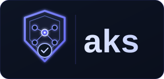
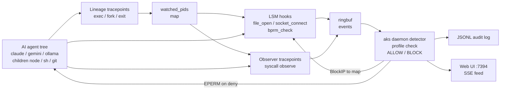

<div align="center">
  
</div>

# aks

eBPF-based runtime security for AI inference workloads.

Aks attaches to AI agent processes (Claude Code, Gemini CLI, Ollama) and enforces a behavioral profile at the kernel level, blocking unexpected file access, network connections, and subprocess spawning before they complete. No code changes required in the target process.

## How it works



- **Kernel layer** (`bpf/`): tracepoints observe syscalls; LSM hooks enforce policy inline
- **Process lineage** (`bpf/probe.c`): tracks agent process trees by PID — follows forks and execs so child processes (`node`, `sh`, `git`) are attributed to the correct agent
- **Profiles** (`profiles/`): YAML files defining allowed paths, networks, and commands per framework
- **Detector** (`internal/detector`): evaluates kernel events against the loaded profile
- **Audit** (`internal/audit`): one JSON line per decision, stdout or file
- **Web UI** (`internal/ui`): real-time event feed with BLOCK/ALLOW badges, served over SSE

## Tech Stack

| Layer | Tech |
|---|---|
| Daemon | Go 1.24 (`cmd/aks`, `internal/`) |
| eBPF | C (`bpf/probe.c`, `bpf/lsm.c`), `clang` + `bpftool`, CO-RE |
| Loader | `github.com/cilium/ebpf`, ringbuf, LSM attach, uprobes |
| CLI | `github.com/spf13/cobra` |
| Profiles | YAML (`gopkg.in/yaml.v3`), `doublestar` globs, CIDR match |
| Kernel | Linux 5.7+ `CONFIG_BPF_LSM=y`, `lsm=bpf`, BTF `/sys/kernel/btf/vmlinux` |
| UI / Audit | SSE + embedded static HTML, JSONL to stdout/file |
| Test | `go test -race`, `testify`, QEMU `linux-image-generic` e2e |

## Requirements

- Linux kernel 5.7+ with `CONFIG_BPF_LSM=y`
- Boot param: `lsm=bpf` (add to `GRUB_CMDLINE_LINUX` in `/etc/default/grub`)
- `clang`, `llvm`, `bpftool`, `linux-headers`
- Root privileges to load eBPF programs
- Go 1.22+

## Quick start

No prebuilt releases are published yet — build from source (Linux amd64/arm64):

```bash
# Prerequisites: Go 1.22+, clang, llvm, bpftool, linux-headers
sudo apt install -y golang-go clang llvm bpftool linux-headers-$(uname -r)

# Build the daemon and the eBPF object
make

# Enable BPF LSM (one-time, requires reboot):
# add lsm=bpf to GRUB_CMDLINE_LINUX in /etc/default/grub, then:
sudo update-grub && sudo reboot
# Verify: cat /sys/kernel/security/lsm  # must contain "bpf"

# Watch an AI agent with the built-in profile
sudo ./aks watch --profile ./profiles/gemini-cli.yaml --bpf-obj bpf/aks.bpf.o

# With real-time web UI at http://localhost:7394
sudo ./aks watch --profile ./profiles/claude-code.yaml --bpf-obj bpf/aks.bpf.o --ui

# Use a custom profile
sudo ./aks watch --profile /path/to/custom.yaml --bpf-obj bpf/aks.bpf.o

# List available profiles
./aks profile list
```

## Output

```json
{"ts":"2026-01-01T00:00:00Z","pid":1234,"comm":"gemini","event":"file_open","path":"/etc/passwd","action":"BLOCK","reason":"matches denied path pattern"}
{"ts":"2026-01-01T00:00:01Z","pid":1234,"comm":"node","event":"net_connect","dest_ip":"1.2.3.4","dest_port":443,"action":"ALLOW","reason":"default policy: allow — destination network not in allowlist"}
```

## Process lineage tracking

AI agents spawn many child processes (`node`, `sh`, `python3`, `git`, ...) that share comm names with unrelated system processes. Without lineage tracking, aks would either miss agent children or produce noise from VS Code, SSH daemons, and cron jobs with the same comm.

Aks solves this with BPF process lineage tracking:

1. `entry_comm` in the profile names the agent's root process (e.g. `gemini`)
2. A `sched_process_exec` tracepoint detects when that process starts and adds its PID to `watched_pids`
3. A `sched_process_fork` tracepoint propagates membership to all descendants
4. A `sched_process_exit` tracepoint removes PIDs when processes exit (prevents PID reuse false positives)
5. Observation tracepoints only emit events for PIDs in `watched_pids`

Result: aks sees exactly the agent's process tree — nothing more.

```yaml
# profiles/gemini-cli.yaml
entry_comm: gemini   # root process to track
```

## Profiles

| Profile | Entry process | Status |
|---|---|---|
| `ollama` | `ollama` | Available |
| `claude-code` | `claude` | Available |
| `gemini-cli` | `gemini` | Available |
| `vllm` | `vllm` | Coming soon |
| `llamacpp` | `server` | Coming soon |

## Testing

```bash
# Unit tests (works on macOS and Linux, no eBPF required)
make test-unit
# = go test ./internal/... -race -count=1

# Integration / e2e test (Linux + root, requires BPF LSM enabled)
make test-integration
# = make bpf + sudo go test -tags integration ./test/e2e/
```

How to test blocking manually (no agent needed):

```bash
make
sudo ./aks watch --profile ./test-gemini.yaml --bpf-obj bpf/aks.bpf.o > /tmp/aks-test.jsonl 2>&1 &
# in another shell (unwatched, should succeed):
echo test > /tmp/secret.txt && cat /tmp/secret.txt
# via watched tree — run through gemini CLI:
# > read @/tmp/secret.txt   # expect BLOCK file_open /tmp/secret.txt + EPERM
grep BLOCK /tmp/aks-test.jsonl
```

## Demo

See [`coder/`](coder/) for a Coder workspace template that provisions a Ubuntu VM with aks, Claude Code, and Gemini CLI, and runs live jailbreak blocking scenarios.
